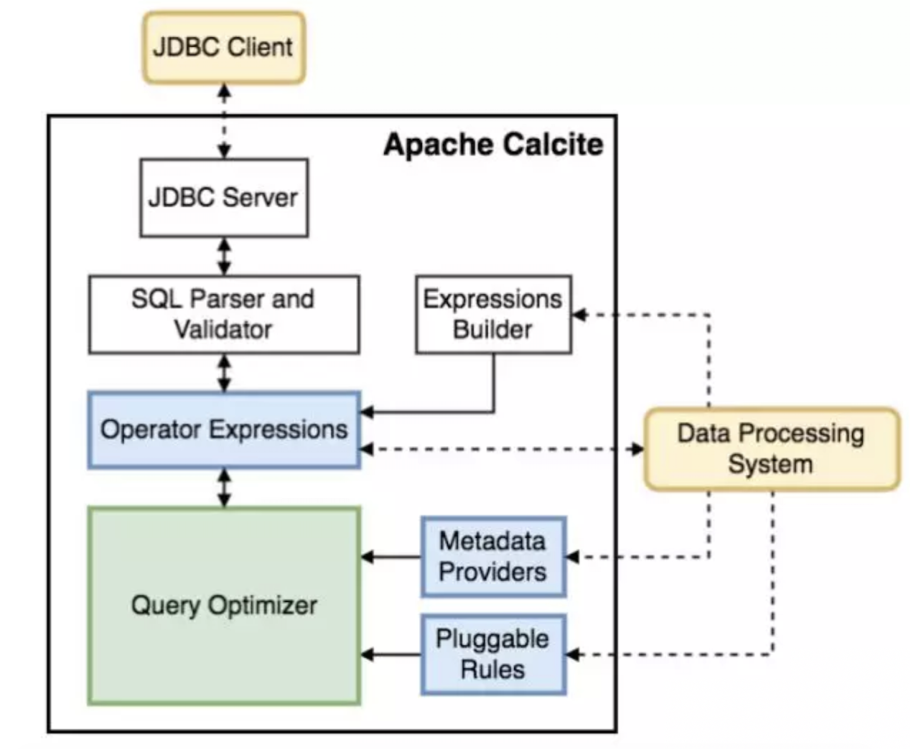

 SQL是Structured Query Language的缩写，最初是由美国计算机科学家 Donald D. Chamberlin 和 Raymond F. Boyce 在 20 世纪 70 年代早期从 Early History of SQL 中了解关系模型后在 IBM 开发的。该版本最初称为[SEQUEL: A Structured EnglishQuery Language]（结构化英语查询语言），旨在操纵和检索存储在 IBM 原始准关系数据库管理系统 System R 中的数据。直到 1986 年， ANSI 和 ISO 标准组正式采用了标准的”数据库语言 SQL”语言定义。Apache Flink SQL 核心算子的语义设计也参考了 1992 、2011 等 ANSI-SQL 标准，主要面向数据库使用。本文通过[calcite](http://calcite.apache.org/)进行sql解析和相关内容的接介绍。 

一. calcite简介

首先看看直接使用 Apache Calcite 或者至少相关联的项目：


接下来我们看看calcite的定位，通常数据库管理系统有5个组件：


calcite的结构：



calcite 被设计的足够模块化和可插拔，JDBC Driver 这个模块用来支持使用 JDBC client 的应用；SQL Parser and Validator 模块用来做 SQL 解析和校验；Expressions Builder 用来支持自己做 SQL 解析和校验的框架对接；Operator Expressions 这个模块用来处理关系表达式；Metadata Providers 用来支持外部自定义元数据；Pluggable Rules 用来定义优化规则；最核心的 Query Optimizer 则专注查询优化。

二. 语法解析

  语法解析主要的关键就是识别标识符或者特定的语言模板，通常我们可以使用下面技术进行开发实现：
```java
SString sql = "CREATE TABLE tab (" +
          "a bigint," +
          "h varchar," +
          "g bigint," +
          "ts timestamp," +
          "b varchar" +
          ") " +
          "WITH (" +
          "connector='kafka'," +
          "kafka.topic='log.test'" +
          ")";
```
1. sql正则解析
```java
   @Test
   public void runPattern() {
      String CREATE_TABLE_PATTERN_STR = "(?i)create\\s+table\\s+(\\S+)\\s*\\((.+)\\)\\s*with\\s*\\((.+)\\)";
      Matcher matcher = Pattern.compile(CREATE_TABLE_PATTERN_STR).matcher(Utils.sql);
      if(matcher.find()){
         String tableName = matcher.group(1);System.out.println(tableName);
         String fieldsInfoStr = matcher.group(2);
         String propsStr = matcher.group(3);
      }
   }
```
2. java主流的语法解析器
2.1 antlr
2.1.1定义antrl模板CreateTable.g4并生成解析类
```java
grammar CreateTable;

@header{
    package pingle.wang.ddl;
}

create_table_stmt :
       T_CREATE T_TABLE table_name (LPAREN columnNameTypeList RPAREN)? T_WITH LPAREN tablePropertiesList RPARENs
     ;

tablePropertiesList
    :	keyValueProperty (T_COMMA keyValueProperty)*
    ;
keyValueProperty
    :	confName EQUAL confValue
    ;
confName
	:	StringLiteral
	;
confValue
	:	StringLiteral
	;

columnNameTypeList
    :	columnNameType (T_COMMA columnNameType)*
    ;

columnNameType
    :	column_name WS column_type
    ;

column_type
	:	StringLiteral
	;

column_name
	:	Identifier
	;

table_name
	:	(STAR DOT) ? STAR
	;

T_CREATE     : 'CREATE' ;
T_TABLE     : 'TABLE' ;
T_WITH     : 'WITH' ;

Identifier
    :	(Letter | Digit) (Letter | Digit | '_')*
    ;

StringLiteral
    :	(
    		'\'' ( ~('\''|'\\') | ('\\' .) )* '\''
    	)+
    ;

LPAREN							:	'(' ;
RPAREN							:	')' ;
EQUAL 							:	'=' | '==';
T_COMMA                         :   ',' ;
STAR 							:	[a-z]+ ;
DOT								:	'.';
SEMICOLON                       :	';' ;
WS  :   (' ')+ ;
WSOPT   :   (' ')* ;

fragment
Letter
    :	'a'..'z' | 'A'..'Z'
    ;
fragment
Digit
    :	'0'..'9'
    ;
```
2.1.2 sql解析
```java 

@Test
   public void runAntrl() {
      System.out.println(Utils.sql);
      CharStream input = CharStreams.fromString(Utils.sql);

      //构造词法分析器 lexer，词法分析的作用是产生记号
      CreateTableLexer lexer = new CreateTableLexer(input);

      //用词法分析器 lexer 构造一个记号流 tokens
      CommonTokenStream tokens = new CommonTokenStream(lexer);

      // 使用 tokens 构造语法分析器 parser
      CreateTableParser parser = new CreateTableParser(tokens);
      CreateTableParser.Create_table_stmtContext tableStmt = parser.create_table_stmt();
      String tableName = tableStmt.table_name().getText();
      String columnInfos = tableStmt.columnNameTypeList().getText();
      String props = tableStmt.tablePropertiesList().getText();
   }
```
2.2 javacc
作为一个 SQL 解决方案，关键的 SQL 解析这一步，calcite 没有选择造轮子，而是直接使用了开源的 JavaCC，来将 SQL 语句转化为 Java 代码，然后转化成一颗 AST 供下一阶段使用。
另一个例子，为了支持后面会提到的灵活的元数据功能，calcite 需要支持运行时编译 Java 代码。默认的 JavaCC 太重，需要一个更轻量级的编译器，calcite 同样没有选择造轮子，而是使用了开源的 Janino 方案。
2.2.1 使用calcite-core搭建javacc开发环境
2.2.2 